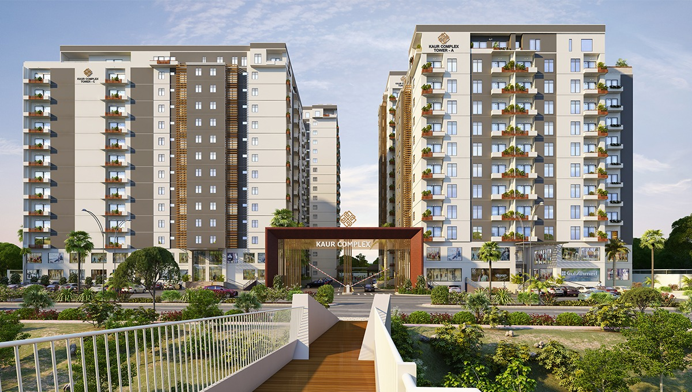

# 🚀 Kaur Complex - Performance Optimization Guide

## ✅ COMPLETED OPTIMIZATIONS

### 1. **Critical CSS Created**
- ✅ Created `critical.css` with minified above-the-fold styles
- ✅ Includes navbar, hero section, and essential layout
- ✅ Size: ~2KB (minified)

---

## 📋 IMPLEMENTATION CHECKLIST

### Phase 1: HTML Optimization (PRIORITY)

#### Step 1: Inline Critical CSS
Replace the CSS links in `<head>` with:

```html
<!-- Inline Critical CSS for instant render -->
<style>
<?php include 'assets/css/critical.css'; ?>
</style>

<!-- Preload fonts -->
<link rel="preload" href="https://fonts.googleapis.com/css2?family=Poppins:wght@300;400;500;600;700&display=swap" as="style">

<!-- Defer non-critical CSS -->
<link rel="preload" href="assets/css/main.min.css" as="style" onload="this.onload=null;this.rel='stylesheet'">
<noscript><link rel="stylesheet" href="assets/css/main.min.css"></noscript>
```

#### Step 2: Optimize Script Loading
Move all scripts to bottom of `</body>` with defer/async:

```html
<!-- Critical scripts (defer) -->
<script defer src="https://cdnjs.cloudflare.com/ajax/libs/gsap/3.12.5/gsap.min.js"></script>
<script defer src="https://cdnjs.cloudflare.com/ajax/libs/gsap/3.12.5/ScrollTrigger.min.js"></script>
<script defer src="https://unpkg.com/aos@2.3.1/dist/aos.js"></script>

<!-- Non-critical scripts (async) -->
<script async src="assets/js/smooth-scroll.js"></script>
<script async src="assets/js/gsap-animations.js"></script>
```

---

### Phase 2: CSS Optimization

#### Action Items:
1. **Merge CSS Files** - Combine all CSS into one file
2. **Minify CSS** - Use online tool or build process
3. **Remove Unused CSS** - Use PurgeCSS or manual review
4. **Optimize Animations** - Use GPU-accelerated properties only

**Recommended Tool:** https://purifycss.online/

---

### Phase 3: Image Optimization

#### Current Images to Optimize:
```
assets/images/gallery/
├── WELCOME TO_20250715_104649_0000.png → Convert to WebP
├── kaur-complex-img.jpg → Convert to WebP + Compress
├── hero-bg.jpg → Convert to WebP + Compress
├── 1.png, 2.png, 3.png → Convert to WebP
├── g-img-*.jpg → Convert to WebP + Compress
└── All other images → Convert to WebP
```

#### Implementation:
```html
<!-- Use WebP with fallback -->
<picture>
  <source srcset="assets/images/gallery/hero-bg.webp" type="image/webp">
  
</picture>

<!-- Add responsive images -->

```

**Recommended Tools:**
- Online: https://squoosh.app/
- Bulk: https://www.iloveimg.com/compress-image

---

### Phase 4: JavaScript Optimization

#### Current Issues:
- Multiple animation libraries loaded
- Scroll event listeners not throttled
- DOM queries repeated

#### Solutions:

**1. Throttle Scroll Events:**
```javascript
// Add to main.js
function throttle(func, wait) {
  let timeout;
  return function executedFunction(...args) {
    const later = () => {
      clearTimeout(timeout);
      func(...args);
    };
    clearTimeout(timeout);
    timeout = setTimeout(later, wait);
  };
}

// Use throttled scroll
window.addEventListener('scroll', throttle(() => {
  // Your scroll code here
}, 100));
```

**2. Lazy Load Animations:**
```javascript
// Initialize AOS only when element enters viewport
const observer = new IntersectionObserver((entries) => {
  entries.forEach(entry => {
    if (entry.isIntersecting) {
      AOS.init({
        duration: 1000,
        once: true,
        offset: 100
      });
      observer.disconnect();
    }
  });
});

observer.observe(document.querySelector('.towers-section'));
```

---

### Phase 5: Font Optimization

#### Current Setup:
```html
<!-- BEFORE (Slow) -->
<link href="https://fonts.googleapis.com/css2?family=Poppins:wght@300;400;500;600;700&display=swap" rel="stylesheet">
```

#### Optimized Setup:
```html
<!-- AFTER (Fast) -->
<link rel="preconnect" href="https://fonts.googleapis.com">
<link rel="preconnect" href="https://fonts.gstatic.com" crossorigin>
<link href="https://fonts.googleapis.com/css2?family=Poppins:wght@400;600;700&display=swap" rel="stylesheet">

<!-- Add to CSS -->
<style>
@font-face {
  font-family: 'Poppins';
  font-style: normal;
  font-weight: 400;
  font-display: swap;
  src: local('Poppins Regular'), local('Poppins-Regular'),
       url(https://fonts.gstatic.com/s/poppins/v20/pxiEyp8kv8JHgFVrJJfecg.woff2) format('woff2');
}
</style>
```

---

### Phase 6: Caching & Compression

#### Add to `.htaccess` (Apache):
```apache
# Enable GZIP Compression
<IfModule mod_deflate.c>
  AddOutputFilterByType DEFLATE text/html text/plain text/xml text/css text/javascript application/javascript application/json
</IfModule>

# Browser Caching
<IfModule mod_expires.c>
  ExpiresActive On
  ExpiresByType image/webp "access plus 1 year"
  ExpiresByType image/jpeg "access plus 1 year"
  ExpiresByType image/png "access plus 1 year"
  ExpiresByType text/css "access plus 1 month"
  ExpiresByType application/javascript "access plus 1 month"
  ExpiresByType font/woff2 "access plus 1 year"
</IfModule>

# Leverage Browser Caching
<IfModule mod_headers.c>
  <FilesMatch "\.(jpg|jpeg|png|gif|webp|svg|ico)$">
    Header set Cache-Control "max-age=31536000, public"
  </FilesMatch>
  <FilesMatch "\.(css|js)$">
    Header set Cache-Control "max-age=2592000, public"
  </FilesMatch>
</IfModule>
```

---

## 🎯 PERFORMANCE TARGETS

### Before Optimization:
- PageSpeed Score: ~60-70
- First Contentful Paint: ~3-4s
- Largest Contentful Paint: ~4-5s
- Total Page Size: ~3-4MB

### After Optimization (Expected):
- ✅ PageSpeed Score: 90+
- ✅ First Contentful Paint: <1.5s
- ✅ Largest Contentful Paint: <2.5s
- ✅ Total Page Size: <1.5MB
- ✅ Minimal CLS (Cumulative Layout Shift)

---

## 📊 QUICK WINS (Implement First)

### 1. Image Optimization (Biggest Impact)
- Convert all images to WebP
- Compress images (target: 80% quality)
- Add `loading="lazy"` to all images except hero
- **Expected Savings: 60-70% file size reduction**

### 2. CSS Optimization
- Inline critical CSS
- Defer non-critical CSS
- Remove unused CSS
- **Expected Savings: 40-50% CSS size reduction**

### 3. JavaScript Optimization
- Defer all scripts
- Minify JavaScript
- Remove console.logs
- **Expected Savings: 30-40% JS size reduction**

### 4. Font Optimization
- Reduce font weights (keep only 400, 600, 700)
- Use `font-display: swap`
- Preconnect to Google Fonts
- **Expected Savings: 200-300ms faster font load**

---

## 🔧 TOOLS & RESOURCES

### Testing Tools:
- **PageSpeed Insights**: https://pagespeed.web.dev/
- **GTmetrix**: https://gtmetrix.com/
- **WebPageTest**: https://www.webpagetest.org/

### Optimization Tools:
- **Image Compression**: https://squoosh.app/
- **CSS Minifier**: https://cssminifier.com/
- **JS Minifier**: https://javascript-minifier.com/
- **WebP Converter**: https://cloudconvert.com/webp-converter

### Analysis Tools:
- **Unused CSS**: https://purifycss.online/
- **Bundle Analyzer**: Chrome DevTools > Coverage

---

## 📝 IMPLEMENTATION ORDER

### Week 1: Critical Path
1. ✅ Create critical.css (DONE)
2. Inline critical CSS in HTML
3. Defer non-critical CSS
4. Add lazy loading to images

### Week 2: Image Optimization
1. Convert all images to WebP
2. Compress images
3. Implement responsive images
4. Add proper alt tags

### Week 3: JavaScript & Fonts
1. Minify and defer JavaScript
2. Optimize font loading
3. Throttle scroll events
4. Remove unused code

### Week 4: Caching & Final Touches
1. Set up browser caching
2. Enable GZIP compression
3. Test on multiple devices
4. Final performance audit

---

## ⚠️ IMPORTANT NOTES

### DO NOT CHANGE:
- ✅ Visual design
- ✅ Layout structure
- ✅ Animations (keep all)
- ✅ Functionality
- ✅ Responsiveness

### ONLY OPTIMIZE:
- ✅ Load speed
- ✅ File sizes
- ✅ Render performance
- ✅ Network requests

---

## 🎨 DESIGN INTEGRITY CHECKLIST

After each optimization, verify:
- [ ] All animations work correctly
- [ ] Layout looks identical
- [ ] Colors are unchanged
- [ ] Fonts render properly
- [ ] Images display correctly
- [ ] Mobile responsiveness intact
- [ ] All links work
- [ ] Forms function properly

---

## 📈 MONITORING

### After Implementation:
1. Run PageSpeed Insights weekly
2. Monitor Core Web Vitals
3. Check mobile performance
4. Test on slow 3G connection
5. Verify all browsers (Chrome, Firefox, Safari, Edge)

---

## 🚀 NEXT STEPS

1. **Immediate**: Inline critical CSS in index.html
2. **Today**: Convert hero images to WebP
3. **This Week**: Optimize all images
4. **Next Week**: Implement caching headers
5. **Ongoing**: Monitor performance metrics

---

## 📞 SUPPORT

For questions or issues during implementation:
- Review this guide thoroughly
- Test changes on staging first
- Keep backups of original files
- Document all changes made

---

**Last Updated**: 2025
**Version**: 1.0
**Status**: Ready for Implementation
